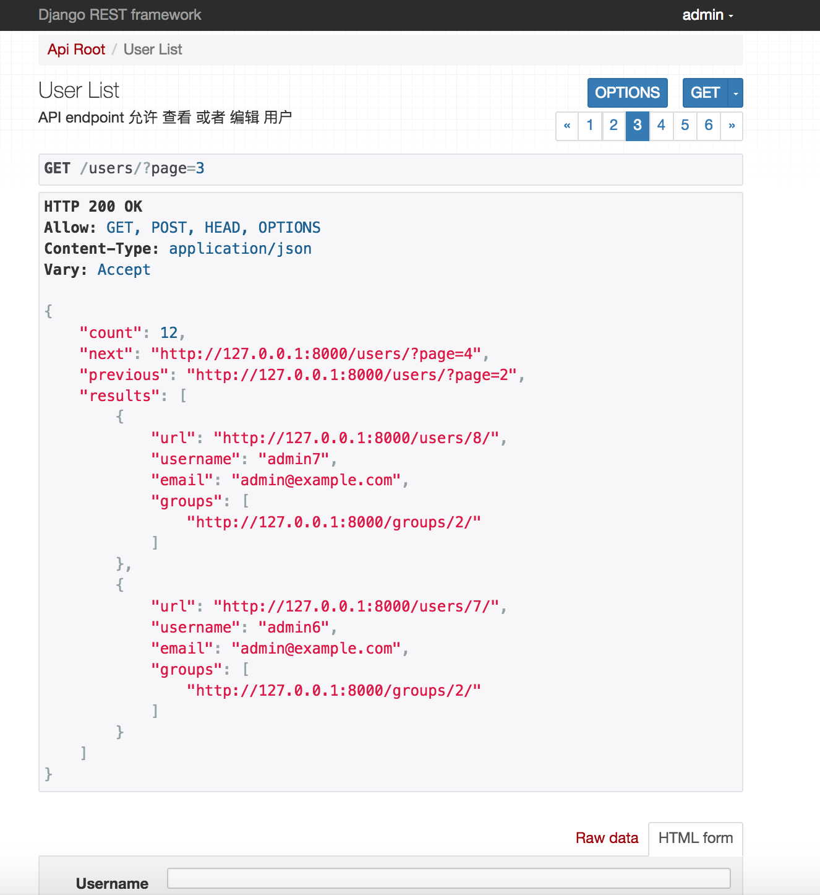
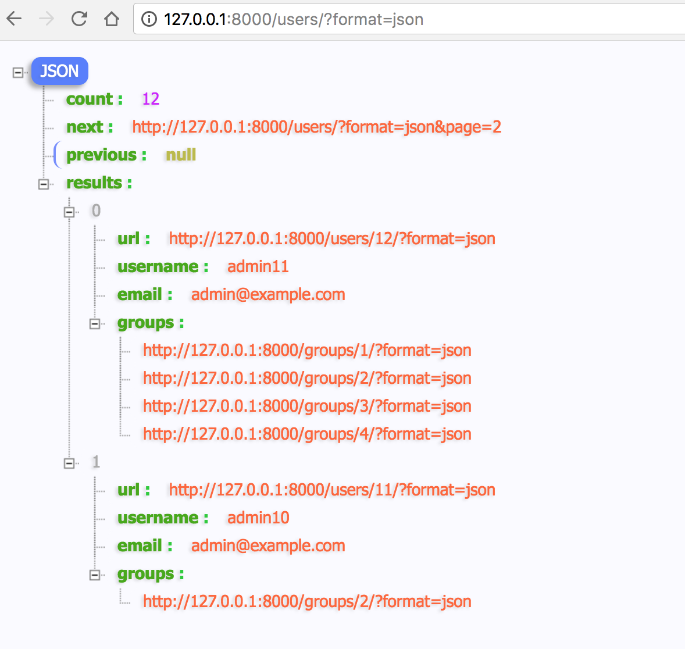
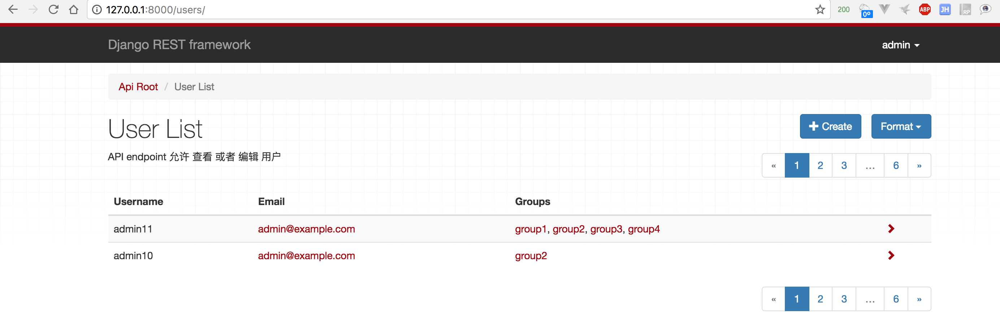

## 渲染器Renderers

> 在TemplateResponse 实例返回给客户端之前，它必须被渲染。渲染的过程采用模板和上下文变量的中间表示形式，并最终将它转换为可以发送给客户端的字节流。  
—— Django官方文档(TemplateResponse and SimpleTemplateResponse)

点击此处，[查看官方文档](https://docs.djangoproject.com/en/2.0/ref/template-response/)

REST framework包含很多的内置渲染器类。允许你使用各种各样的媒体类型返回响应。还可以设置自定义的渲染器类，来灵活的设计你自己的媒体类型。

#### 渲染器是如何确定的

视图中有效的渲染器总是被设置为一个包含类的列表。当进入一个```View```逻辑的时候，REST framework会对传进来的请求执行内容协商，并且最终会确定一个最合适的渲染器，以满足Request。

内容协商的最基本的过程是检查HTTP请求头的```Accept```，用来确定哪种Media类型是响应最期望的。可选的，URL的格式后缀被用于显示请求特定的表示。比如，URL```http://example.com/api/users_count.json```可能只会返回JSON数据。

更多信息查看[内容协商文档](./cnegotiation.md)

#### 设置渲染器

默认情况下渲染器的设置可能是通过```DEFAULT_RENDERER_CLASSES```设置的全局的。比如，下面的设置将会使用```JSON```作为主要的媒体类型并且还包括可HTML浏览API。

```python
REST_FRAMEWORK = {
    'DEFAULT_RENDERER_CLASSES': (
        'rest_framework.renderers.JSONRenderer',
        'rest_framework.renderers.BrowsableAPIRenderer',
    )
}
```

你还可以为基于```APIView```的单个视图或者视图集合(```viewset```)设置渲染器：

```python
from django.contrib.auth.models import User
from rest_framework.renderers import JSONRenderer
from rest_framework.response import Response
from rest_framework.views import APIView

class UserCountView(APIView):
    """
    A view that returns the count of active users in JSON.
    """
    renderer_classes = (JSONRenderer, )

    def get(self, request, format=None):
        user_count = User.objects.filter(active=True).count()
        content = {'user_count': user_count}
        return Response(content)
```

或者为基于```@api_view```装饰器的函数视图设置渲染器：

```python
@api_view(['GET'])
@renderer_classes((JSONRenderer,))
def user_count_view(request, format=None):
    """
    A view that returns the count of active users in JSON.
    """
    user_count = User.objects.filter(active=True).count()
    content = {'user_count': user_count}
    return Response(content)
```

#### 渲染器类的排序

当为您的API指定渲染器类的时候，要考虑你想要分配给每种Media类型的优先级，这一点非常重要。当客户端没有指定一个可以接受的表现形式，比如发送一个```Accept: */*```HTTP请求头，或者在请求头中不包括任何```Accept```，那么REST framework将会选择列表中的第一个渲染器来用于响应数据。

比如你的API服务器支持```JSON```的响应和HTML可浏览的API，你可能想要指定```JSONRenderer```为你默认的渲染器，这样那些没有指定```Accept```HTTP头的客户端将会接收到```JSON```响应。

如果你的API服务器，包含可以根据请求来确定提供常规网页和API响应的视图，你可能会考虑设置```TemplateHTMLRenderer```作为你的默认的渲染器。

---

<br />
<br />
<br />
<br />

### API 参考

关于渲染器的源码位置： ```rest_framework.renderers```

#### ```JSONRenderer```渲染器

使用UTF-8编码，将请求数据渲染为```JSON```。

注意，默认情况下包含Unicode字符串，并且用紧凑的格式来呈现，没有多余的空白符：

```python
{"unicode black star":"★","value":999}
```

客户端可能会包含额外的Media类型参数```indent```，这表示返回的```JSON```数据会被缩进。比如```Accept: application/json; indent=4```：

```javascript
{
    "unicode black star": "★",
    "value": 999
}
```

默认的编码风格使用```UNICODE_JSON```和```COMPACT_JSON```设置来修改。

在```rest_framework.settings.DEFAULTS``` 中有如下设置：

```python
DEFAULTS = {
    ……省略……

    # Encoding
    'UNICODE_JSON': True,
    'COMPACT_JSON': True,
    'STRICT_JSON': True,
    'COERCE_DECIMAL_TO_STRING': True,
    'UPLOADED_FILES_USE_URL': True,

    # Browseable API
    'HTML_SELECT_CUTOFF': 1000,
    'HTML_SELECT_CUTOFF_TEXT': "More than {count} items...",

    ……省略……
}
```

```.media_type```为 ```application/json```

URL ```.format```后缀为： ```'.json'```

```.charset```: ```None```

#### ```TemplateHTMLRenderer```渲染器

使用Django标准的模板渲染将数据渲染到HTML中。不像其他渲染器，数据被传递给```Response```不需要序列化。另外，与其他渲染器不同，在创建```Response```的时候你需要包含```template_name```参数。

渲染器```TemplateHTMLRenderer```将会创建一个```RequestContext```， 使用```response.data```作为内容，并且确定一个模板名称用于渲染一个内容。

模板名称是按照下面的顺序来确定的：

1. 显式的传递给```Response```对象一个```template_name```参数。
2. 在类里面明确的设置```.template_name```属性。
3. 返回```view.get_template_names()```的结果。

下面是一个使用```TemplateHTMLRenderer```渲染器的示例：

```python
class UserDetail(generics.RetrieveAPIView):
    """
    A view that returns a templated HTML representation of a given user.
    """
    queryset = User.objects.all()
    renderer_classes = (TemplateHTMLRenderer,)

    def get(self, request, *args, **kwargs):
        self.object = self.get_object()
        return Response({'user': self.object}, template_name='user_detail.html')
```

如果你要使用```TemplateHTMLRenderer```，你可以使用REST framework返回一个常规的HTML 页面，或者从一个单一的Endpoint同时返回HTML和API响应数据。

如果你使用```TemplateHTMLRenderer```和其他的渲染器来构建你的Web站点，你应该考虑将```TemplateHTMLRenderer```放在```renderer_classes```列表的第一个，这样即使客户端的HTTP Request Header中的```ACCEPT```不正确，它也会优先使用```TemplateHTMLRenderer```。

参考链接，[HTML & Forms Topic Page](http://www.django-rest-framework.org/topics/html-and-forms/)来查看更多的案例使用。

```.media_type```为 ```text/html```

URL ```.format```后缀为： ```'.html'```

```.charset```: ```utf-8```

#### ```StaticHTMLRenderer```渲染器

一个简单的渲染器，它会返回一个```预渲染```的HTML。不像其他的渲染器，传递给```Response```对象的数据应该是一个表示要返回的字符串。

下面是一个使用```StaticHTMLRenderer```的例子：

```python
@api_view(('GET',))
@renderer_classes((StaticHTMLRenderer,))
def simple_html_view(request):
    data = '<html><body><h1>Hello, world</h1></body></html>'
    return Response(data)
```

如果你要使用```StaticHTMLRenderer```，你可以使用REST framework返回一个常规的HTML 页面，或者从一个单一的Endpoint同时返回HTML和API响应数据。

```.media_type```为 ```text/html```

URL ```.format```后缀为： ```'.html'```

```.charset```: ```utf-8```

注意： ```StaticHTMLRenderer```渲染器类是```TemplateHTMLRenderer```渲染器类的子类。

#### ```BrowsableAPIRenderer```渲染器

为可视化的API将数据渲染到HTML中。

默认情况下，REST framework使用的这种方式进行渲染。默认配置(```rest_framework.settings```)如下：


```python
DEFAULTS = {
    # Base API policies
    'DEFAULT_RENDERER_CLASSES': (
        'rest_framework.renderers.JSONRenderer',
        'rest_framework.renderers.BrowsableAPIRenderer',
    ),
    ……省略……
}
```



该渲染器，会确定哪个渲染器具有最高的级别，然后使用它在HTML页面中显示API的响应样式。

使用```.json```的形式如下：



```.media_type```: ```text/html```

```.format```: ```'.api'```

```.charset```: ```utf-8```

```.template```: ```'rest_framework/api.html'```

源代码如下：

```python
class BrowsableAPIRenderer(BaseRenderer):
    """
    HTML renderer used to self-document the API.
    """
    media_type = 'text/html'
    format = 'api'
    template = 'rest_framework/api.html'
    filter_template = 'rest_framework/filters/base.html'
    code_style = 'emacs'
    charset = 'utf-8'
    form_renderer_class = HTMLFormRenderer

    def get_default_renderer(self, view):
    """
    Return an instance of the first valid renderer.
    (Don't use another documenting renderer.)
    """
    renderers = [renderer for renderer in view.renderer_classes
                    if not issubclass(renderer, BrowsableAPIRenderer)]
    non_template_renderers = [renderer for renderer in renderers
                                if not hasattr(renderer, 'get_template_names')]

    if not renderers:
        return None
    elif non_template_renderers:
        return non_template_renderers[0]()
    return renderers[0]()

    ……省略……
```

##### 自定义```BrowsableAPIRenderer```

默认情况下，响应内容将使用最高优先级渲染器渲染，除了```BrowsableAPIRenderer```。如果你需要自定义此行为，例如使用HTML作为默认返回格式，但在可浏览的API中使用JSON，则可以通过重写```get_default_renderer()```方法来实现。默认情况下(看上面的源代码)，会检测第一个有效的渲染器来进行渲染，并不肯定是使用```JSONRender```来进行渲染的。例如：

```python
class CustomBrowsableAPIRenderer(BrowsableAPIRenderer):
    def get_default_renderer(self, view):
        return JSONRenderer()
```

#### ```AdminRenderer```渲染器

已类似管理员(Django Admin)的方式在HTML中渲染数据。



此渲染器适用于CRUD风格的Web API，它还应该提供用于管理数据的用户友好界面。

注意，如果你的视图有嵌套或者是列表序列化，那么当使用```AdminRenderer```的时候如果进行表单输入，那么HTML不会很好的支持。

**注意**： 只有在你的序列化数据中包含正确的```URL_FIELD_NAME```(默认是```url```)属性的时候，```AdminRenderer```渲染器才会包含到```detail```页面的链接。只有在使用```HyperlinkedModelSerializer```的时候才会包含该属性，如果使用```ModelSerializer```或者是常规的```Serializer```类的时候，需要手动显式指定该字段。比如，在这里我们使用模型的```get_absolute_url```方法：

```python
class AccountSerializer(serializers.ModelSerializer):
    url = serializers.CharField(source='get_absolute_url', read_only=True)

    class Meta:
        model = Account
```

```.media_type```: ```text/html```

```.format```: ```'.admin'```

```.charset```: ```utf-8```

```.template```: ```'rest_framework/admin.html'```

#### ```HTMLFormRenderer```渲染器

将序列化返回的数据渲染进HTML表单。

渲染器的输出不会包含完整的```<form>```标签，隐藏的```CSRF```和任意的提交按钮。

这个渲染器不能被直接使用。但是可以给序列化实例传递```render_form```模板标签来替代模板。

更多的信息参考[HTML & Forms](../topics/forms.md)文档。

```.media_type```: ```text/html```

```.format```: ```'.form'```

```.charset```: ```utf-8```

```.template```: ```'rest_framework/horizontal/form.html'```

#### ```MultiPartRenderer```渲染器

这个渲染器被用来渲染HTML multipart form数据。它不适用与作为一个响应渲染器。但是可以用它来创建一个测试请求， 使用REST framework的[测试客户端和测试请求工厂](./testing.md)。

```.media_type```: ```multipart/form-data; boundary=BoUnDaRyStRiNg```

```.format```: ```'.multipart'```

```.charset```: ```utf-8```

---

<br />
<br />
<br />
<br />

### 自定义渲染器

如果要实现一个自定义的渲染器，你应该重写```BaseRenderer```方法。并设置```.media_type```和```.format```属性，并且实现```.render(self, data, media_type=None, renderer_context=None)```方法。

这个方法应该返回一个```bytestring```，被用于HTTP Response body。

传递给```.render```的参数解释如下：

- ```data```:  请求数据，这个数据是```Response()```设置的。
- ```media_type=None```: 可选的，如果设定，那么就是在内容协商阶段确定的接收的Media type。依赖客户端的```Accept```头。
- ```renderer_context=None```: 可选的。如果设定，那么这是由```view```提供的上下文信息。是一个字典。默认情况下这个字典会包括以下键： ```view```, ```request```, ```response```, ```args```, ```kwargs```。

#### 例子

下面是一个文本渲染器的例子，它将返回一个带有```data```数据参数的响应作为响应的内容。

```python
from django.utils.encoding import smart_unicode
from rest_framework import renderers


class PlainTextRenderer(renderers.BaseRenderer):
    media_type = 'text/plain'
    format = 'txt'

    def render(self, data, media_type=None, renderer_context=None):
        return data.encode(self.charset)
```

#### 设置字符集

默认的渲染器使用的是```UTF-8```编码，如果要设置不同的编码格式，在渲染器中设置```charset```参数：

```python
class PlainTextRenderer(renderers.BaseRenderer):
    media_type = 'text/plain'
    format = 'txt'
    charset = 'iso-8859-1'

    def render(self, data, media_type=None, renderer_context=None):
        return data.encode(self.charset)
```

注意，如果一个渲染类返回了一个unicode字符串，则响应内容将被```Response```类强制转换成bytestring，渲染器上的设置的 charset 属性将用于确定编码。

如果渲染器返回一个bytestring表示原始的二进制内容，则应该设置字符集的值为 None，确保响应请求头的 ```Content-Type``` 中不会设置 ```charset``` 值。

在某些情况下你可能还需要将 ```render_style``` 属性设置成 ```'binary'```。这么做也将确保可浏览的API不会尝试将二进制内容显示为字符串。

```python
class JPEGRenderer(renderers.BaseRenderer):
    media_type = 'image/jpeg'
    format = 'jpg'
    charset = None
    render_style = 'binary'

    def render(self, data, media_type=None, renderer_context=None):
        return data
```

---

<br />
<br />
<br />
<br />

### 高级渲染器用法

你可以使用REST framework的渲染器来做一些非常灵活的事情。比如：

- 根据请求的Media type，从同一个Endpoint既能提供单一的又能提供嵌套的表示。
- 从一个Endpoint既能处理常规的HTML页面又能提供基于JSON的API响应。
- 为API客户端提供多种形式的HTML表现。
- 未指定渲染器的媒体类型，例如使用 ```media_type = 'image/*'```，并使用 Accept 标头来更改响应的编码。

#### 通过媒体类型(Media Type)改变行为

在一些场景下，你可能想要你的视图根据接收的media type来使用不同的序列化风格。如果你想要实现这个功能，你可以访问```request.accepted_renderer```来确定用于Response的协商渲染器。

比如：

```python
@api_view(('GET',))
@renderer_classes((TemplateHTMLRenderer, JSONRenderer))
def list_users(request):
    """
    这个视图可以返回系统中的用户，以 JSON 或者是 HTML的表现形式
    """
    queryset = Users.objects.filter(active=True)

    if request.accepted_renderer.format == 'html':
        # TemplateHTMLRenderer takes a context dict,
        # and additionally requires a 'template_name'.
        # It does not require serialization.
        data = {'users': queryset}
        return Response(data, template_name='list_users.html')

    # JSONRenderer requires serialized data as normal.
    serializer = UserSerializer(instance=queryset)
    data = serializer.data
    return Response(data)
```

#### 不明确的media type

在某些场景中，你可能想要渲染器提供一组媒体类型。在本案例中你可以使用```image/*```或者```*/*```来指定一个不明确的媒体类型。

如果你不指定媒体类型，那么应该在响应数据中的```content_type```属性中指定媒体类型。比如这样：

```python
return Response(data, content_type='image/png')
```

#### 设计你的媒体类型

大多数Web APIs的目的很简单，它们只需要返回一个JSON数据，用超链接来表现数据之间的关系就足够的。但是如果你想要更加完整的拥抱RESTful设计和HATEOAS需要更详细的考虑媒体类型的设计和使用。

用Roy Fielding的话来说，"REST API 应该花费所有的描述性努力来定义用于表示资源和驱动应用程序状态的媒体类型（们），或者为现有的标准媒体类型定义扩展关系名称和/或超文本启用标记"。

关于优秀的自定义媒体类型，参考链接：

- https://developer.github.com/v3/media/
- http://www.amundsen.com/media-types/collection/

#### HTML 错误视图

通常渲染器都具有相同的行为，无论它处理的是正常的响应还是由异常引起的响应，如 ```Http404``` 或 ```PermissionDenied``` 异常，或者任何一个 ```APIException``` 的子类。

如果你正在使用 ```TemplateHTMLRenderer``` 或 ```StaticHTMLRenderer``` 时抛出了异常，行为略有不同。并且反映 [Django对错误视图的默认处理](https://docs.djangoproject.com/en/2.0/topics/http/views/#customizing-error-views).

由HTML渲染器引发异常和处理的异常将尝试按照优先顺序使用以下方法之一进行渲染。

- 加载并渲染一个名为 ```{status_code}.html```的模板。
- 加载并渲染一个名为 ```api_exception.html```的模板。
- 渲染HTTP状态码和文本，例如 "404 Not Found"。

模板将使用一个包括```status_code```和```details```的 ```RequestContext``` 渲染。

注意: 如果设置了 ```DEBUG=True```，Django将展示它的标准回溯错误页面, 而不是渲染HTTP状态码和文本。

---

<br />
<br />
<br />
<br />

### 第三方包

下面都是一些第三方可用的包。

#### YAML

包[REST framework YAML](https://jpadilla.github.io/django-rest-framework-yaml/) 提供 YAML 解析和渲染支持。它之前直接包含在REST framework 包中，现在被替代为第三方包支持。

**安装和配置**:

使用pip安装：

```shell
$ pip install djangorestframework-yaml
```

修改设置：

```python
REST_FRAMEWORK = {
    'DEFAULT_PARSER_CLASSES': (
        'rest_framework_yaml.parsers.YAMLParser',
    ),
    'DEFAULT_RENDERER_CLASSES': (
        'rest_framework_yaml.renderers.YAMLRenderer',
    ),
}
```

#### XML

包[REST Framework XML](https://jpadilla.github.io/django-rest-framework-xml/) 提供了一个简单的非正式XML格式。它之前直接包含在REST framework 包中，现在被替代为第三方包支持。

**安装和配置**:

使用pip安装：

```shell
$ pip install djangorestframework-xml
```

修改设置：

```python
REST_FRAMEWORK = {
    'DEFAULT_PARSER_CLASSES': (
        'rest_framework_xml.parsers.XMLParser',
    ),
    'DEFAULT_RENDERER_CLASSES': (
        'rest_framework_xml.renderers.XMLRenderer',
    ),
}
```

#### JSONP

包[REST framework JSONP](https://jpadilla.github.io/django-rest-framework-jsonp/)提供JSONP的渲染支持。它之前直接包含在REST framework 包中，现在被替代为第三方包支持。

---

警告: 如果你需要跨域的AJAX请求，你通常应该使用更现代化的```CORS```方法代替JSONP。更多详细信息请参阅[CORS文档](../cors.md)。

jsonp 本质上是一个浏览器hack方法，仅适用于全局可读的API路径，其中GET请求未经身份验证，并且不需要任何用户权限。

---

**安装和配置**:

使用pip安装：

```shell
$ pip install djangorestframework-jsonp
```

修改设置：

```python
REST_FRAMEWORK = {
    'DEFAULT_RENDERER_CLASSES': (
        'rest_framework_jsonp.renderers.JSONPRenderer',
    ),
}
```

#### MessagePack

[MessagePack](https://msgpack.org/)是一种快速，高效的二进制序列化格式。Juan Riaza维护着[djangorestframework-msgpack](https://github.com/juanriaza/django-rest-framework-msgpack) 包，它为REST framework提供MessagePack渲染器和解析器支持。

#### CSV

逗号分隔的值是纯文本数据格式，可以轻松导入到电子表格应用中。Mjumbe Poe维护着[djangorestframework-csv](https://github.com/mjumbewu/django-rest-framework-csv)包，它为REST framework提供了CSV渲染器支持。

#### UltraJSON

UltraJSON是一个优化的C JSON编码器，可以显著提高JSON渲染速度。Jacob Haslehurst维护着使用UJSON包实现JSON渲染的[drf-ujson-renderer](https://github.com/gizmag/drf-ujson-renderer)包。

#### 驼峰JSON

[djangorestframework-camel-case](https://github.com/vbabiy/djangorestframework-camel-case)为REST framework提供了驼峰样式的JSON渲染器和解析器。这使序列化程序可以使用Python风格的下划线字段名，但是在API中显示成Javascript样式的驼峰字段名。它被Vitaly Babiy维护着。

#### Pandas (CSV, Excel, PNG)

[Django REST Pandas](https://github.com/wq/django-rest-pandas)提供了一个序列化器和渲染器，通过```Pandas``` DataFrame API提供额外的数据处理和输出。Django REST Pandas包括Pandas风格的CSV文件，Excel表格(包括 .xls 和 .xlsx)以及许多其他格式的渲染器。作为wq 项目的一部分由S. Andrew Sheppard维护着。

#### LaTeX

[Rest Framework Latex](https://github.com/mypebble/rest-framework-latex)提供了一个使用Laulatex输出PDF的渲染器。它由Pebble (S/F Software)维护着。

---

参考链接：

- https://docs.djangoproject.com/en/2.0/ref/template-response/
- https://docs.djangoproject.com/en/2.0/topics/http/views/#customizing-error-views
- https://developer.github.com/v3/media/
- http://www.amundsen.com/media-types/collection/
- https://jpadilla.github.io/django-rest-framework-yaml/
- https://jpadilla.github.io/django-rest-framework-xml/
- https://jpadilla.github.io/django-rest-framework-jsonp/