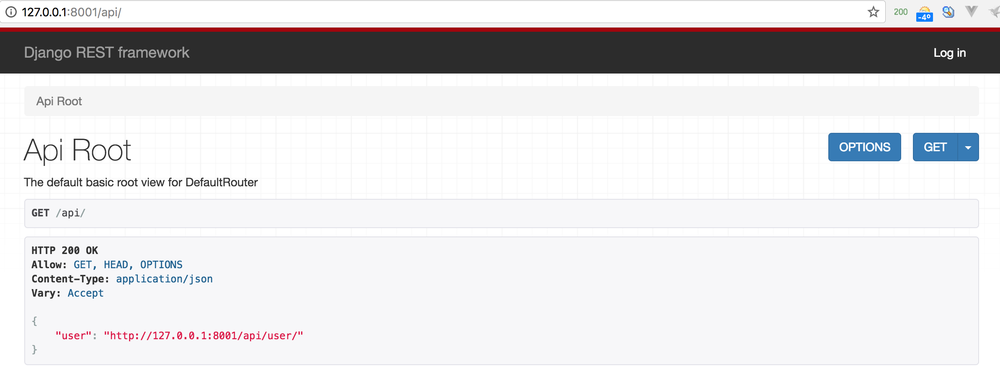
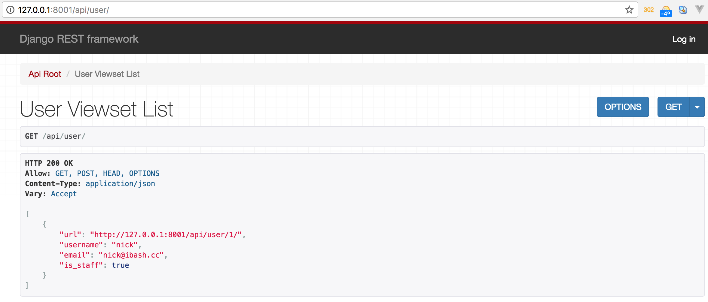
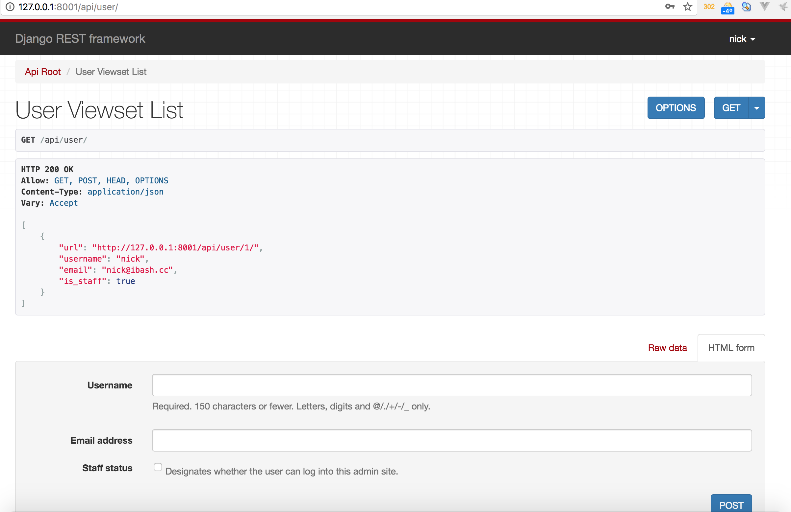
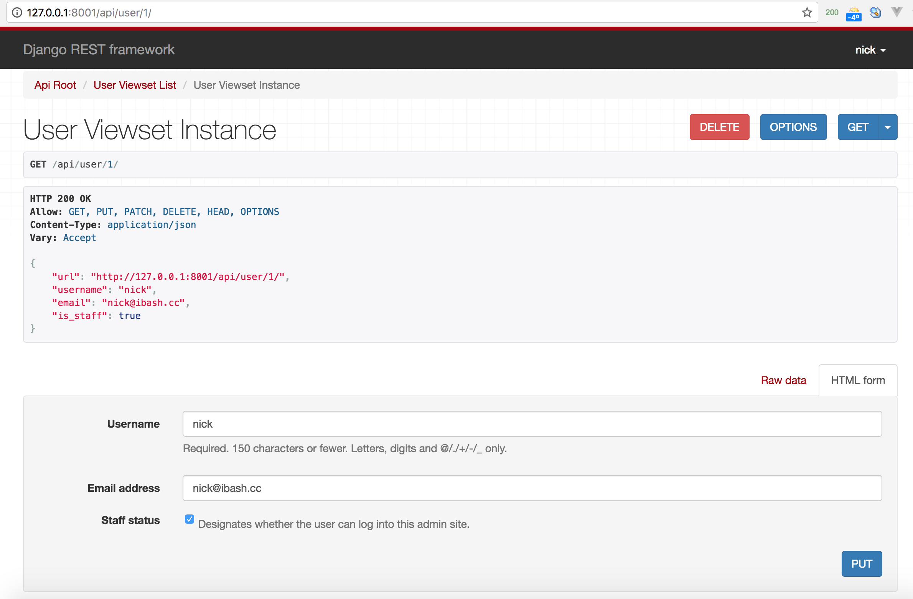

## 举例

让我们看一个用REST framework来构建一个简单的基于model的API。

我们将创建一个可读写的API来访问我们项目的用户信息。

所有关于REST framework的全局配置都放置在一个名为```REST_FRAMEWORK```的字典中。首先在```settings.py```中增加如下内容：
```python
REST_FRAMEWORK = {
    # 使用Django 标准的 `django.contrib.auth` 权限,
    # 或者 对于 未认证的用户提供只读权限.
    'DEFAULT_PERMISSION_CLASSES': [
        'rest_framework.permissions.DjangoModelPermissionsOrAnonReadOnly'
    ]
}
```
提示： 不要忘记在```INSTALLED_APPS```中添加```rest_framework```。

现在，我们准备创建API。下面是我们项目的```root urls.py```模块：
```python
from django.conf.urls import url
from django.contrib import admin
from django.conf.urls import include
from django.contrib.auth.models import User
from rest_framework import routers
from rest_framework import serializers
from rest_framework import viewsets


# Serializers 定义了API 数据的表现形式
class UserSerializer(serializers.HyperlinkedModelSerializer):
    class Meta:
        model = User
        fields = ('url', 'username', 'email', 'is_staff')


# Viewsets 定义了视图行为
class UserViewset(viewsets.ModelViewSet):
    queryset = User.objects.all()
    serializer_class = UserSerializer


# Routers 提供了一个非常便捷的方式 自动生成 URL 配置
router = routers.DefaultRouter()
router.register(r'user', UserViewset)

# 将自动生成的URL 配置 放置在真正的路由配置中
# 此外, 我们还配置登录 登出的 路由
urlpatterns = [
    url(r'^admin/', admin.site.urls),
    url(r'^api/', include(router.urls)),
    url(r'^api-auth/', include('rest_framework.urls', namespace='rest_framework'))
]
```

下面让我们创建一个Django用户:
```shell
python manage.py makemigrations

python manage.py migrate

python manage.py createsuperuser
```

现在你可以在浏览器输入```http://127.0.0.1:8001/api/(地址和端口根据自己启动的情况而定)```来查看```users```API。



点击```users```的API链接，进入如下界面：



右上角有登录按钮，如果登录, 那么就可以创建或者删除用户, 登录之后，界面如下：


注意， 这个界面只能进行```users```的创建。```POST```方法。

点击某个用户的URL，这里是```http://127.0.0.1:8001/api/user/1/```，就会进入某个对象的界面，如下：


注意，这个界面可以对某个具体的对象(这里是用户), 进行更新或者删除的操作。 ```PUT``` 和 ```DELETE```方法。
