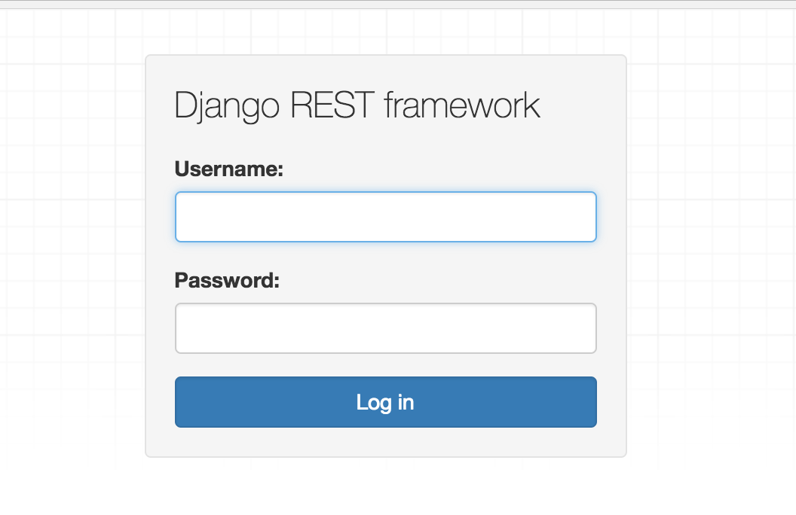

## 依赖环境

REST framework 有以下依赖:
- Python (2.7, 3.2, 3.3, 3.4, 3.5, 3.6)
- Django (1.10, 1.11, 2.0)

下面的包是可选的：
- coreapi (1.32.0+) - 生成schema支持
- Markdown (2.1.0+) - 可视化的API支持
- django-filter (1.0.1+) - 过滤支持
- django-crispy-forms - 为过滤提供更好的HTML显示
- django-guardian (1.1.1+) - 对象级别的权限支持

## 安装

使用```pip```可以安装REST framework和其他任何的可选安装包：
```shell
pip install django==1.11.10

pip install djangorestframework==3.7.7

pip install markdown  # 为可视化API 提供支持

pip install django-filter  # 过滤支持
```

或者是从github克隆项目:
```shell
git clone git@github.com:encode/django-rest-framework.git
```

添加```'rest_framework'```到Django的```INSTALLED_APPS```设置中：
```python
# Application definition

INSTALLED_APPS = [
    ……
    'rest_framework',
]
```

如果你打算使用可视化的API，那么你可能需要REST framework的登录和登出功能。在你的```root urls.py```中增加如下内容:
```python
urlpatterns = [
    ……
    url(r'^api-auth/', include('rest_framework.urls', namespace='rest_framework'))
]
```
注意：url的路径可以随便定义,但是必须```include('rest_framework.urls')```


