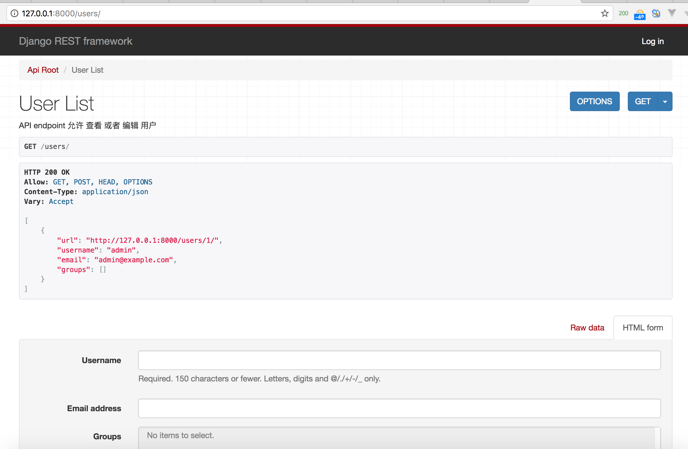

## 测试API

现在，让我们来测试我们构建的API, 首先启动服务器
```shell
python manage.py runserver
```

使用```curl```来访问我们的API
```shell
curl -H 'Accept: application/json; indent=4' -u admin:password123 http://127.0.0.1:8000/users/
[
    {
        "url": "http://127.0.0.1:8000/users/1/",
        "username": "admin",
        "email": "admin@example.com",
        "groups": []
    }
]
```

或者直接通过浏览器来访问



注意，右上角的登录按钮。

Great，如此简单快捷。

想要了解更深入的内容，请继续以下的内容。